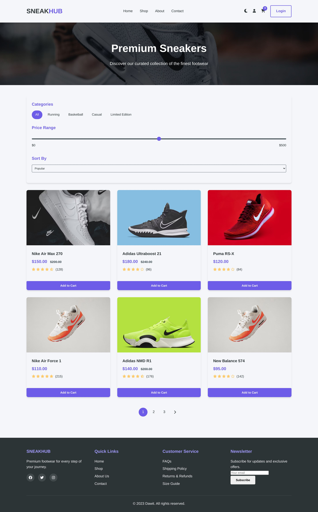
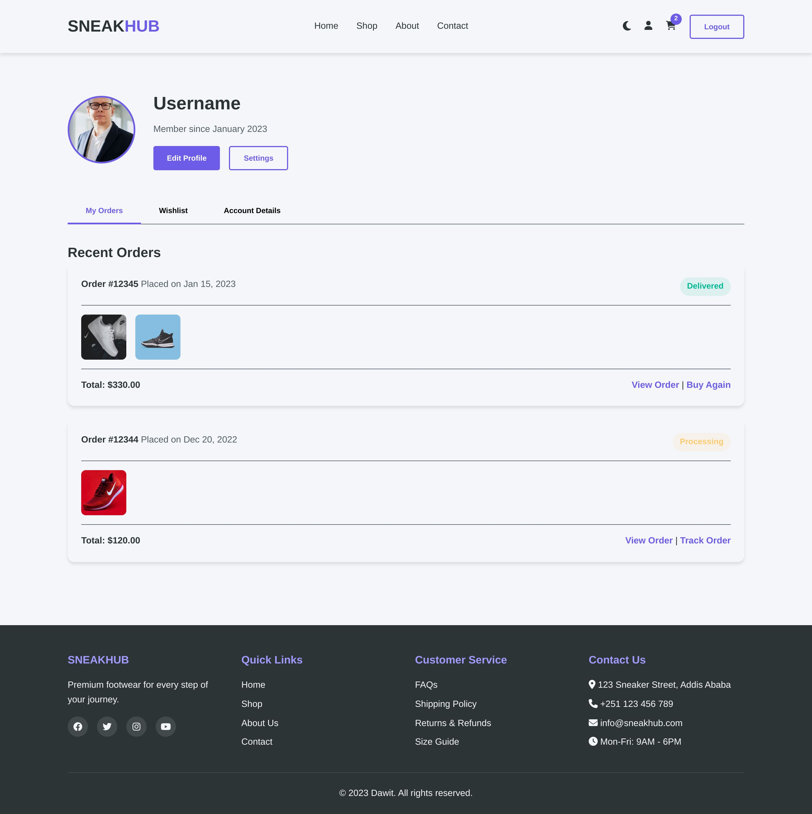

# URBANCART - E-Commerce Website

A complete online store with product listings, shopping cart, and checkout system.

## Features

- Responsive product grid
- Functional shopping cart
- Product filtering by category
- Checkout process with form validation
- Mobile-friendly design
- LocalStorage for cart persistence

## Technologies

- HTML5
- CSS3 (Flexbox, Grid)
- JavaScript (ES6)
- LocalStorage API
- Google Fonts
- Font Awesome

## Project Structure
ecommerce-site/
- ├── index.html          # Homepage with featured products
- ├── products.html       # Full product catalog
- ├── cart.html           # Shopping cart page
- ├── checkout.html       # Checkout process
- ├── css/
- │   ├── styles.css      # Main styles
- │   └── responsive.css  # Responsive styles
- ├── js/
- │   ├── main.js         # Core functionality
- │   ├── cart.js         # Cart management
- │   └── products.js     # Product data and filtering
- └── images/             # Product images and assets

# screenshots
# URBANCART - E-Commerce Website

A complete online store with product listings, shopping cart, and checkout system.

## Features

- Responsive product grid
- Functional shopping cart
- Product filtering by category
- Checkout process with form validation
- Mobile-friendly design
- LocalStorage for cart persistence

## Technologies

- HTML5
- CSS3 (Flexbox, Grid)
- JavaScript (ES6)
- LocalStorage API
- Google Fonts
- Font Awesome

## Project Structure
ecommerce-site/
- ├── index.html          # Homepage with featured products
- ├── products.html       # Full product catalog
- ├── cart.html           # Shopping cart page
- ├── checkout.html       # Checkout process
- ├── css/
- │   ├── styles.css      # Main styles
- │   └── responsive.css  # Responsive styles
- ├── js/
- │   ├── main.js         # Core functionality
- │   ├── cart.js         # Cart management
- │   └── products.js     # Product data and filtering
- └── images/             # Product images and assets

# screenshots
<!--
  This HTML snippet creates a responsive gallery for your GitHub project screenshots.
  It uses Tailwind CSS classes for styling, which are generally supported in GitHub READMEs.
  The image paths and titles have been updated based on your provided project details.
-->

  <h2 class="text-3xl font-bold text-center mb-8">Project Screenshots</h2>

  

    

      
      

        
Home Page

      

    

    

      
      

        
Shop Page

      

    

    

      
      

        
About Us Page

      

    

    

      
      

        
Contact Page

      

    

    

      
      

        
Shopping Cart

      

    

    

      
      

        
User Profile

      

    

    

      
      

        
Login Page

      

    

  

